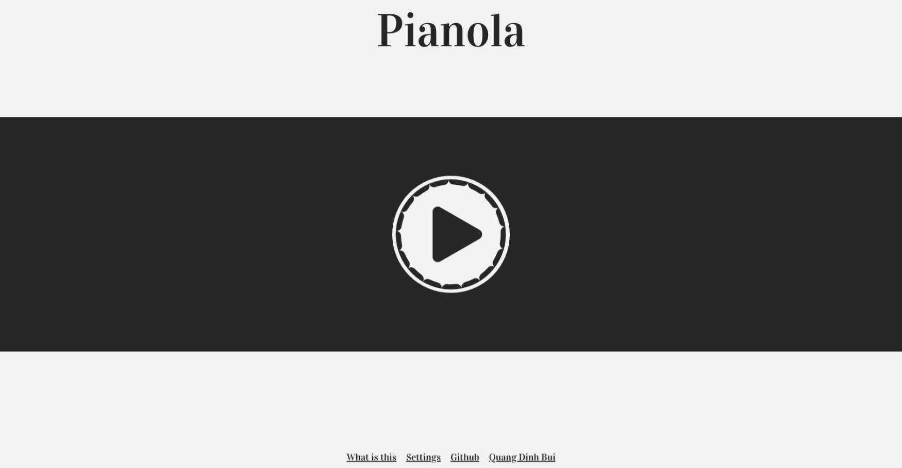
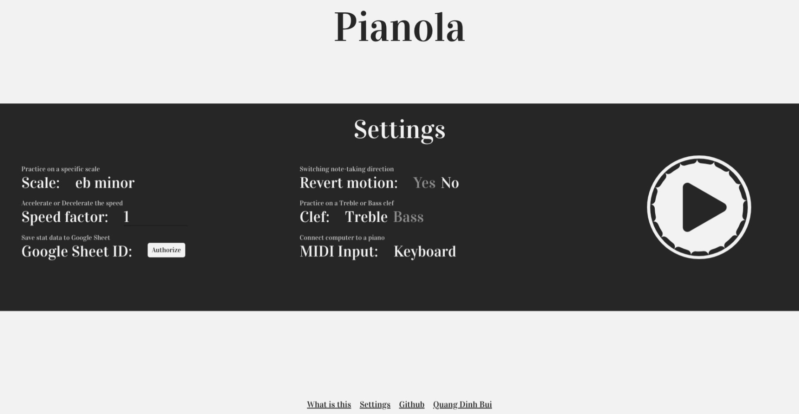
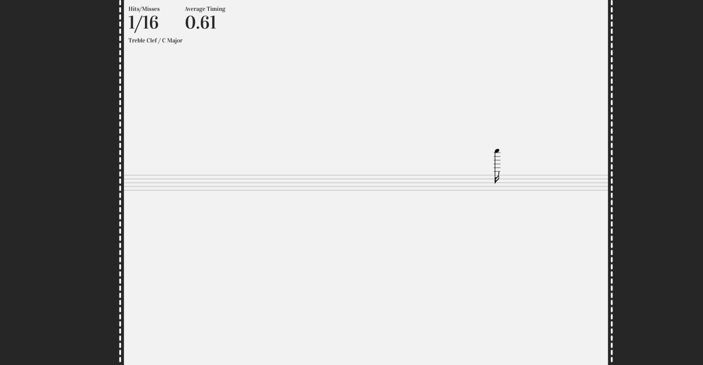
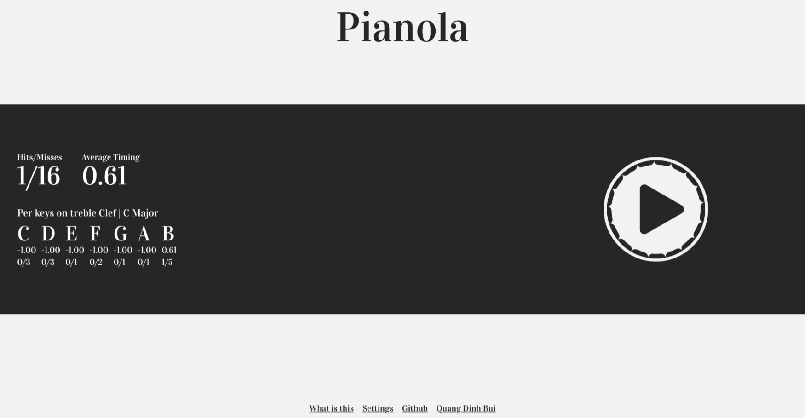

# Pianola
The primary goal of this project is pretty simple and straightforward (at least for me) that is "spamming" practicing sight-read musical notes as many times as possible.


## Authors

- [@bquangDinh](https://github.com/bquangDinh)

## Blog
- [My Blog](https://qdinh.me/jupiter)

# Pianola
The primary goal of this project is pretty simple and straightforward (at least for me) that is "spamming" practicing sight-read musical notes as many times as possible.


## Features

- Practice notes on any scales
- Accelerate or Decelerate speed of notes
- Practice on Treble or Bass clef
- Revert motion (reading from left to right or right to left)
- Save stats of the trial to the given Google Sheet (make sure you make your sheet public and editable by everyone)

## Previews









## For devs
If you want to twist Pianola in your favor, I have a few options

1. Clone the project
2. Add a new .env file to the root of the project
3. The structure of .env is as follow

```env
VITE_APP_TITLE=

VITE_MIDI_CONTROLLER_INPUT=keyboard

VITE_SHEET_AVG_TIMING_SAVED_RANGE="A2"
VITE_SHEET_HITS_SAVED_RANGE="B2"
VITE_SHEET_MISSES_SAVED_RANGE="C2"
VITE_SHEET_KEY_NAME_SAVED_RANGE="F2"
VITE_SHEET_KEY_HITS_SAVED_RANGE="G2"
VITE_SHEET_KEY_MISSES_SAVED_RANGE="H2"
VITE_SHEET_KEY_AVG_TIMING_SAVED_RANGE="I2"

VITE_TREBLE_RANGE_START=3
VITE_TREBLE_RANGE_END=7

VITE_BASS_RANGE_START=3
VITE_BASS_RANGE_END=4

VITE_GOOGLE_SHEET_API_KEY=

VITE_GOOGLE_SHEET_PROD_REDIRECT_URI=
VITE_GOOGLE_SHEET_DEV_REDIRECT_URI=

VITE_GOOGLE_SHEET_CLIENT_ID=
VITE_GOOGLE_SHEET_PROJECT_ID=
VITE_GOOGLE_SHEET_AUTH_URI=
VITE_GOOGLE_SHEET_TOKEN_URI=
VITE_GOOGLE_SHEET_AUTH_PROVIDER_X509_CERT_URL=
VITE_GOOGLE_SHEET_CLIENT_SECRET=

VITE_GOOGLE_SHEET_PROD_JAVASCRIPT_ORIGIN=
VITE_GOOGLE_SHEET_DEV_JAVASCRIPT_ORIGIN=
```

### Explain .env options
- `VITE_MIDI_CONTROLLER_INPUT`: While I was developing this project, I couldn't carry my piano keyboard with me. So I had to create a mockup version to stimulate the MIDI input. It has two options `piano` or `keyboard`. Use `piano` if your piano (that has MIDI) is nearby and you can use it, otherwise, use `keyboard`. The `keyboard` option will use your computer keyboard as the MIDI input. Each row on the keyboard stimulates an octave ranging from octave 3 to 5 (on the piano). If you want to change it, I wrote it in `keyboard-controller.ts`, make sure you take a look.
- `VITE_SHEET_AVG_TIMING_SAVED_RANGE`: this is used to indicate the column in the Google Sheet where the `Average Timing` stat is placed
- `VITE_SHEET_HITS_SAVED_RANGE`: this is used to indicate the column in the Google Sheet where the `Hits Count` stat is placed
- `VITE_SHEET_MISSES_SAVED_RANGE`: this is used to indicate the column in the Google Sheet where the `Misses Count` stat is placed
- `VITE_SHEET_KEY_NAME_SAVED_RANGE`: this is used to indicate the column in the Google Sheet where the `Key name` stat is placed
- `VITE_SHEET_KEY_HITS_SAVED_RANGE`: this is used to indicate the column in the Google Sheet where the `Hits count per key` stat is placed
- `VITE_SHEET_KEY_MISSES_SAVED_RANGE`: this is used to indicate the column in the Google Sheet where the `Misses Count per key` stat is placed
- `VITE_SHEET_KEY_AVG_TIMING_SAVED_RANGE`: this is used to indicate the column in the Google Sheet where the `Average Timing per key` stat is placed
> Make sure you place the first 3 stats on the columns that are next to each other. For example D2,E2,F2 or A2,B2,C2 .etc. Same as for the last 4 stats, but make sure you seperate the first 3 stats and the last 4 stats at least one column. For example, A2,C2,D2 (for the first 3 stats), E2 will be used as a seperator, and then F2,G2,H2,I2 (for the last 4 stats)
- `VITE_TREBLE_RANGE_START`: indicates the starting octave on the treble clef
- `VITE_TREBLE_RANGE_END`: indicates the ending octave on the treble clef
- `VITE_BASS_RANGE_START`: indicates the starting octave on the bass clef
- `VITE_BASS_RANGE_END`: indicates the ending octave on the bass clef
> The rest of the file is for Google Sheet API. For more details of how to obtain these information. Go [here](https://developers.google.com/sheets/api/quickstart/js)
4. The last thing is build it! `npm run build`